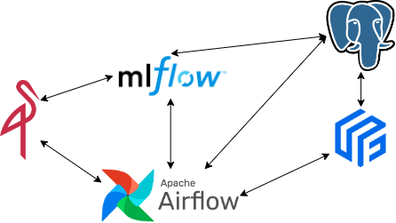
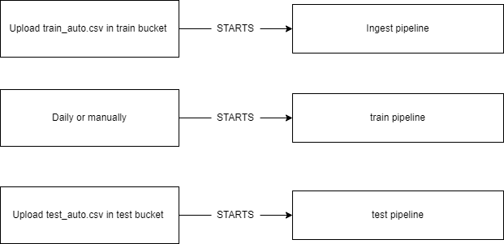

# Project Documentation
The project presents a possible production environment (not complete).

## Structure
The project has the following folder:
- 0_eda, it contains some analysis to create the full project
- airflow, it contains dags folder that is the folder that actually contains the project
- dbinit, it contains a "migration" to create the db
- feast, it contains the information neeeded for the feast repo
- minio, it contains files uploaded in minio (AWS S3 alternative (available on Docker))

## Architecture

### minio: http://localhost:9001/
username: user  
password: password  
Used to store files (like train, test and results) and mlflow artifacts

### airflow: http://localhost:8082/
username: airflow  
password: airflow  
Used to orchestrate the pipelines

### mlflow http://localhost:5000
Used to show the results, track experiments and correctly organize models

### feast http://localhost:8888/
Used to correctly manage multiple feature version and reproduce experiments if needed.

### Postgres http://localhost:8081/ (with adminer)
Server: postgres  
username: user  
password: password  
Used to store airflow data, mlflow data, feast data

## Workflow
- Login on Airflow
- Activate ingest, train, and test pipeline (example dags are really annoying)
- Login on Minio and upload train_auto.csv on train bucket
- run the train pipeline from Airflow
- Wait the end (or reduce gridsearch parameters)
- upload test_auto.csv on test bucket
- get result on Minio in result bucket

### Ingest
- Wait for the train file in S3 Bucket
- Extract file from the bucket
- Load data on Potgres

### Train
- Get point-in-time data using Feast from Offline Store (Postgres)
- Train the model making a grid search cv
- Track experiment and save model on MLFlow

## Test
- Wait for the test file in S3 Bucket
- Extract file from the bucket
- load best (best f1) model from MLFlow
- predict results and save on s3 bucket
- if you want download results from Minio

## Consideration
- the manual file loading is not the best, but in a production-like envinroment data can be uploaded using a pipeline
- my final goal was to create the full pipeline, with also adding new data from test on feast as in a real environmet can happen after human intervention (maybe with some active learning strategy)
